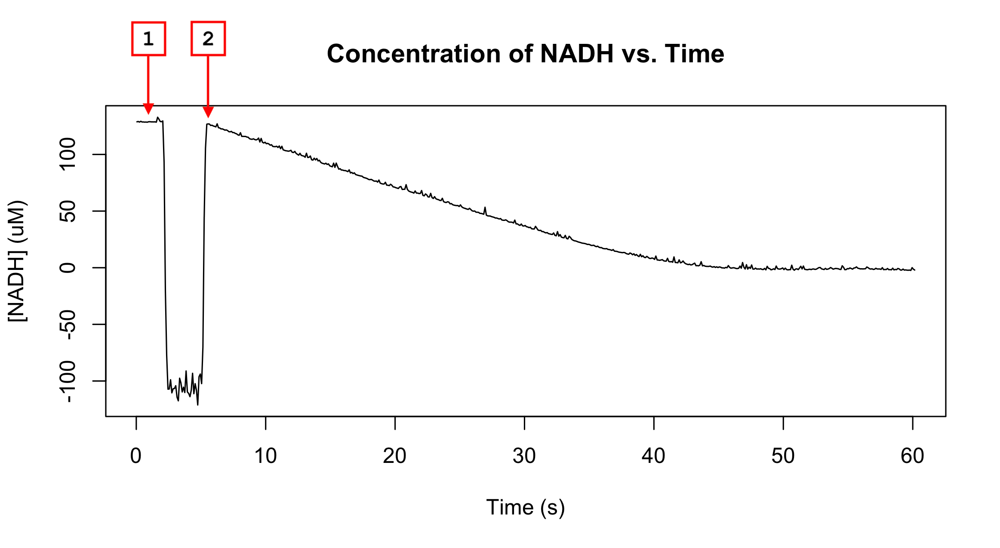

<!-- README.md is generated from README.Rmd. Please edit that file -->

# Kinetics

<!-- badges: start -->
<!-- badges: end -->

#### [Web application link](https://hmlea.shinyapps.io/kinetics/)

**Kinetics** is a web application that performs different enzymatic
calculations and creates simple and effective plots. The application
allows the calculation of rate from absorbance data and the generation
of Michaelis-Menten plots from substrate concentration and rate data.
The plots created by **Kinetics** can be exported as PNG images of any
given size and can be used freely by you.

## Usage

This web application has two main features: it allows for the
calculation of enzyme rates and solves for and plots the
Michaelis-Menten equation. The **Kinetics** web app can be accessed
[here](https://hmlea.shinyapps.io/kinetics/) or you can download and run
it on your machine using the Shiny package with the following code:

    `shiny::runGitHub("hmlea/kinetics")`

### Rates

The rates feature of the app allows you to upload one or more CSV files
containing absorbance vs. time data. Any number of spreadsheets can be
uploaded at once but they must have time in the first column and
absorbance in the second column.

Once uploaded, each spreadsheet will be plotted and you will be prompted
to click on each plot twice. For the first click, click on the baseline
concentration; for the second click, click on peak immediately after the
substrate is added and concentration starts to decrease. Try to choose
points with as little noise as possible and are closest to what the true
concentration might be. Also, note that it doesn’t matter what y value
you click on; the application only takes into consideration the x
coordinate. See below for an example of where to click.

After clicking through all the plots, a table below the plot window will
populate with the calculated rates. Make sure to click through each plot
before uploading more spreadsheets. All the plots can be downloaded as a
zip file with the “Download Plots” button and can be exported with or
without the linear regression used to find the rate. The title of each
plot contains the name of the file uploaded, and the time used to
calculate the linear regression.

### Michaelis-Menten

The other feature of the app generates Michaelis-Menten plots from
substrate concentration and rate data. You must upload a single
spreadsheet that contains this data, with substrate concentration in the
first column and rate in the second column. This data is plotted and a
Michaelis-Menten curve is fit and added to the graph. Doing this solves
for the Vmax and KM which is plotted alongside the
curve in the top right hand corner of the plot. This plot can also be
downloaded as an image with the “Download Plot” button.

## To Do

In the future, I would like to:

- Allow the customization of more basic plot features
- Add the ability to overlay multiple Michaelis-Menten plots
- Rework the download button and add the ability to lock the aspect
  ratio
- Allow for certain plot features to be selectively hidden or shown
- Expand and enhance the upload spreadsheet functionality
- Add an advanced features option that allows more customization
